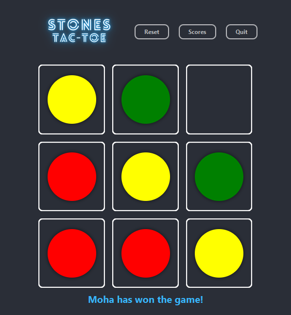

# StonesTacToe
### a game board consisting of 3x3 cells, each of which can contain a piece of stone, and a set of colored (red, yellow, and green) stones. 

## Game Rules:
 1. placing a red stone into an empty cell,
 2. replacing a red stone on the board with a yellow stone,
 3. replacing a yellow stone on the board with a green stone.

## Gameplay:

